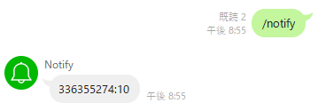

# return-line-notify

## Overview

Since the Line Notify service has been discontinued, this Python script uses Line Works as an alternative method for sending notifications.

## Usage

```sh
python --version # Python 3.13.3
pip install -r requirements.txt
```

```sh
uvicorn return-line-notify.main:app --host 0.0.0.0 --port 3333
```

or

```sh
python -m return-line-notify.main
```

## Send Request

!

```python
import requests
API_URI = "http://127.0.0.1:8000/api/notify"
headers = {"Authorization": "Bearer 336355274:10"}
data = {"message": "test"}
requests.post(API_URI, headers=headers, data=data)
```

## Credits

This project is inspired by and references the following open-source project:

- <https://github.com/nanato12/pseudo-line-notify>
