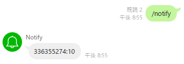

# return-line-notify

## Overview

Since the Line Notify service has been discontinued, this Python script uses Line Works as an alternative method for sending notifications.

The server keeps a LINE WORKS session and an MQTT connection open, and relays `POST /api/notify` requests as LINE WORKS messages.

## Usage

```sh
python --version # Python 3.13
pip install -r requirements.txt
```

```sh
uvicorn return_line_notify.main:app --host 0.0.0.0 --port 3333
```

or

```sh
python -m return_line_notify.main
```

### Docker

```sh
docker run -d -p 3333:3333 -e WORKS_ID="admin@example" -e PASSWORD="password" ghcr.io/fa0311/return-line-notify/return-line-notify-docker:latest
```

### Environment variables

| Name                        | Default          | Description                                                                 |
| --------------------------- | ---------------- | --------------------------------------------------------------------------- |
| `WORKS_ID`                  | (required)       | LINE WORKS ID                                                               |
| `PASSWORD`                  | (required)       | LINE WORKS password                                                         |
| `LOG_PATH`                  | `.log/debug.log` | Debug log file (rotated daily)                                              |
| `HTTP_CONNECT_TIMEOUT_SEC`  | `10`             | Connect timeout for LINE WORKS HTTP requests                                |
| `HTTP_READ_TIMEOUT_SEC`     | `30`             | Read timeout for LINE WORKS HTTP requests                                   |
| `MQTT_IDLE_TIMEOUT_SEC`     | `0` (off)        | Reconnect when nothing is received from MQTT for this long. LINE WORKS sends nothing but notifications, so keep it off |
| `RELOGIN_INTERVAL_SEC`      | `21600`          | Re-establish the MQTT session periodically (no password login while the cookie is valid) |
| `RECONNECT_BACKOFF_MAX_SEC` | `300`            | Upper bound of the exponential reconnect backoff                            |
| `UNHEALTHY_EXIT_SEC`        | `600`            | Exit the process (so Docker restarts it) after being disconnected this long. `0` disables |

## Send Request

!

```python
import requests

API_URI = "http://127.0.0.1:3333/api/notify"
headers = {"Authorization": "Bearer 336355274:10"}
data = {"message": "test"}
requests.post(API_URI, headers=headers, data=data)
```

The bearer token is `<channel_no>:<channel_type>`. Send `/notify` in a LINE WORKS talk room to get its token.

| Status | Meaning                                                        |
| ------ | -------------------------------------------------------------- |
| `200`  | Sent                                                           |
| `400`  | Missing or malformed bearer token                              |
| `415`  | Body must be `application/x-www-form-urlencoded` or `multipart/form-data` |
| `502`  | LINE WORKS rejected the request (the session is re-verified in the background) |
| `503`  | Not logged in to LINE WORKS yet                                |
| `504`  | LINE WORKS did not respond in time                             |

## Endpoints

| Path                  | Description                                                                       |
| --------------------- | --------------------------------------------------------------------------------- |
| `POST /api/notify`    | Send a text / sticker / image message                                             |
| `POST /api/reconnect` | Close the MQTT connection and log in again                                        |
| `GET /health`         | `200` while the MQTT connection is established, otherwise `503` with details      |
| `GET /metrics`        | Prometheus metrics (`line_notify_connected`, `line_notify_reconnects_total`, ...) |

## Talk commands

| Message      | Reply                                   |
| ------------ | --------------------------------------- |
| `/test`      | `ok`                                    |
| `/notify`    | `<channel_no>:<channel_type>` (the token) |
| `/reconnect` | Reconnect to MQTT                       |

## Development

```sh
pip install -r requirements.txt -r requirements-dev.txt
pytest                      # unit tests
RLN_INTEGRATION=1 pytest    # also hit a server running on :3333
```

## Credits

This project is inspired by and references the following open-source project:

- <https://github.com/nanato12/pseudo-line-notify>
